# **Տուփաձև մակերևույթների կիրառումը ճանապարհաշինության և ճարտարապետության մեջ**

# **Ներածություն**

Ավտոմոբիլային ճանապարհների վերանորոգման և կապիտալ վերանորոգման նախագծման ժամանակ\` նախագծման ավտոմատացված համակարգերի միջոցով, կարևորագույն քայլերից է ճանապարհի օպտիմալ (գործող և նախագծային) մակերևույթի ստացումը (երթևեկելի մաս, ճամփեզրեր, թեքություններ և այլն)\` ըստ մի շարք չափանիշների (երբեմն այդ չափանիշները հարյուրավոր են), օրինակ՝ ըստ թեքության, բացարձակ բարձրության, ստորգետնյա ջրերի մակարդակից բարձրության, ջրատար խողովակի վերին մասից հեռավորության և այլն: CAD-երի (նախագծման ավտոմատացված համակարգերի) մեծ մասում նախագծի թվային մոդելը կառուցվում է Դելոնեի եռանկյունացման միջոցով (նկ. 1):

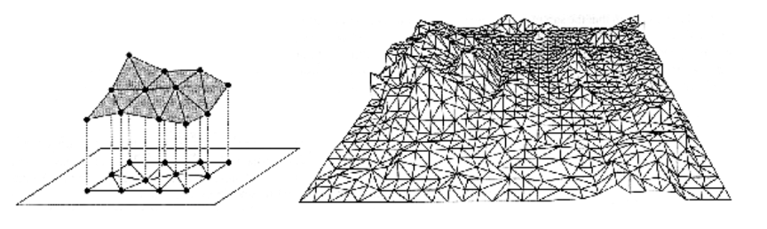
Նկ 1. Մակերևույթի ձևը\` ներկայացված ռելիեֆի թվային մոդելով՝ օգտագործելով Դելոնի եռանկյունացումը :

 Տվյալ մաթեմատիկական մեթոդը բավական լավ է (մաթեմատիկորեն ճշգրիտ) վերականգնում է տեղանքի ռելիեֆը, ինչպես նաև գործող ճանապարահատվածի և հարակից տարածքի մոդելը, սակայն դրա օգտագործումը վերանորոգման և կապիտալ վերանորոգման օպտիմալացման նպատակով հանգեցնում է երկայնական և լայնական հարթությունների չափազանց մեծ փոփոխության, ինչի հետևանքով՝ բացառում է օպտիմալացման հնարավորությունները\` ըստ չափանիշների (հողի տեղափոխման նվազագույն ծավալ՝ պահպանելով միջին գիծը, նորմատիվ թեքությունը, լայնությունը և այլն): 

Ժամանակակից CAD-երում վերանորոգման և կապիտալ վերանորոգման ժամանակ թվարկված չափանիշներով օպտիմալ նախագծային մակերևույթ ստեղծելու անհնարինությունը մեծացնում է նախագծային փաստաթղթերի մշակման աշխատատարությունը և, ի վերջո, բարձրացնում վերանորոգման արժեքը \[1\]: 

Եթե տարածական ձևով պատկերացնենք երթուղու բազմանկյուն (polygonal) ընթացքը, որն ունի մի քանի շրջադարձային անկյուններ հատակագծում և պրոֆիլում, ապա նման համադրությունը կարող է նկարագրվել մեկը մյուսի նկատմամբ որոշակի անկյան տակ գտնվող մի շարք տարրական հարթությունների զուգորդմամբ: Եվ հաճախ հատակագծում գտնվող բազմանկյունը կապված չէ պրոֆիլում գտնվող բազմանկյան հետ (նկ. 2ա): 

Վերանորոգման և կապիտալ վերանորոգման ընթացքում ավտոմոբիլային ճանապարհների նախագծային մոդելի վերականգնման դժվարությունները բազմակիորեն աճում են այն իրավիճակներում, երբ հենարար կորերը ձևավորվում են առանձին՝ ստեղծելով բարդ մակերևույթներ (ճանապարհի առանցքային գիծը, ձախ և աջ եզրագծեր և այլն)։ Իրականում դրանք բարձր կարգի ողորկ միացվող տարածական կորեր են \[2\] (նկ. 2բ):

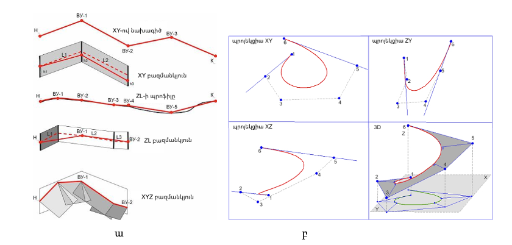
Նկ. 2.Երթուղին, ներկայացված է բազմանկյունների բաժանման տեսքով՝ հատակագծում և պրոֆիլում (ա)․ ավտոմոբիլային ճանապարհի հենարար կորագիծ մակերևույթի տարրը՝ պրոյեկցիաներում և 3D պատկերում(բ)։

Ավտոմոբիլային ճանապարհների նախագծման առկա ավանդական մեթոդները հիմնված են կառուցվածքային (առաջատար) գծերի սկզբունքի վրա, որոնք ձևավորվում են առանցքային գծից կամ երթուղային գծից դրանց շեղմամբ: 

Նախագծողը պետք է «ձեռքով» փնտրի առավել տնտեսող տարբերակը՝ փոփոխելով կառուցվածքային գծերը ավանդական պրոյեկցիաներում (հատակագիծ, պրոֆիլ, լայնական հատույթ), ընտրելով հողային աշխատանքների կամ ճանապարհածածկի շերտերի օպտիմալ ծավալը: Սա առօրեական և աշխատատար խնդիր է, որը ժամանակակից համակարգերում գործնականում գրեթե չի ենթարկվում ավտոմատացման (նկ. 3): Չնայած նոր ավտոմոբիլային ճանապարհների շինարարության նախագծման ժամանակ այս խնդիրը լավ է լուծված, և օպտիմալացումը իրականացվում է նորմատիվ պահանջների չափանիշներով (կորերի շառավղի մեծություն հատակագծում և պրոֆիլում, տեսանելիություն, լանդշաֆտային նախագծման պայմաններ և տարածության մեջ կորերի համադրությունները)՝ կախված ճանապարհի տեսակից: 

Վերանորոգման և կապիտալ վերանորոգման նախագծման ժամանակ ևս մեկ կարևոր խնդիր է երթուղու դիրքի որոշումը՝ հաշվի առնելով աշխատանքների արդյունքում ստացված ծավալները դրանք բերելով հատվածի երկարության միավորին: Միաժամանակ որոշ CAD համակարգերում,  ինչպիսին է ՝ IndorCAD/Road-ում, BIM նախագծման տեխնոլոգիայի շրջանակներում, այս խնդիրը մասամբ է լուծված․ լուծումներ փնտրելիս աշխատանքների ծավալը հայտնի է, սակայն օպտիմալացման չափանիշները պետք է մշտապես ընդունվեն նախագծողի կողմից, ինչը ստեղծում է լրացուցիչ աշխատատարություն և երկարացնում է նախագծման ժամկետները: CAD համակարգերի մեծ մասում շինանյութերի ծավալը հաշվարկվում է միայն նախագծային փաստաթուղթ կազմելուց հետո՝ եռանկյունացման հիման վրա կառուցված  ՏԹՄ (Տեղանքի թվային մոդել) և ՆԹՄ (Նախագծի թվային մոդել) մակերևույթների տարբերության հաշվարկի արդյունքում: Միաժամանակ գործող տեխնոլոգիայում ճանապարհի մի շարք էմպիրիկ հատկություններ և ֆիզիկական պարամետրեր չեն կարող նկարագրվել ալգորիթմորեն ինչը, նշանակում է, որ հաշվի չեն առնվում մոդելում օրինակ՝ ավտոմեքենայի կենտրոնախույս արագացումը, տարածական տեսանելիությունը և այլն, որոնք անմիջականորեն չեն ազդում նախագծային լուծման(կամ որոշման) մշակման վրա, սակայն կարևոր են վերանորոգվող ճանապարհահատվածի տրանսպորտային-շահագործման որակների համար:

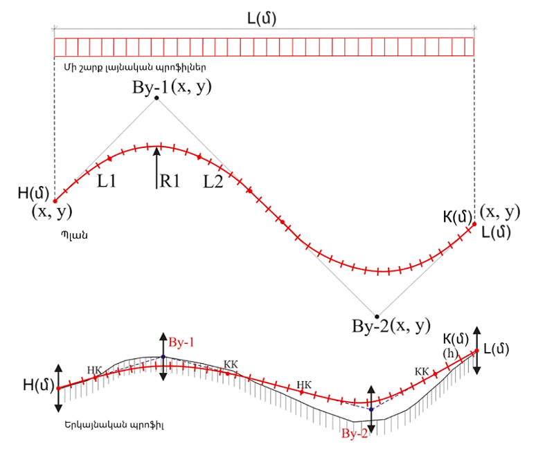
Նկ. 3. Ավտոմոբիլային ճանապարհի երթուղու նախագծային գիծը՝ հատակագծում (վերևում) և պրոֆիլում (ներքևում)

# **Գլուխ 1**
# **§ 1.1 Ավտոմոբիլային ճանապարհների տարածական մոդելավորումը տուփաձև հատույթներ ունեցող մակերևույթներով**

Ավտոմոբիլային ճանապարհների նախագծման մեջ կարևորագույն խնդիրը օպտիմալ ճանապարհի մակերևույթի ստացումն է (երթևեկելի մասի ձախ և աջ կողմերը, ձախ և աջ ճամփեզրերը, ձախ և աջ թեքությունները և այլն)\` ըստ մի շարք չափանիշների(երբեմն այդ չափանիշները հարյուրավոր են), օրինակ՝ ըստ թեքության, բացարձակ բարձրության, ստորգետնյա ջրերի մակարդակից բարձրության, ջրատար խողովակի վերին մասից հեռավորության և այլն: CAD-երի (նախագծման ավտոմատացված համակարգերի) մեծ մասում նախագծի թվային մոդելը կառուցվում է Դելոնեի եռանկյունացման միջոցով:

Ավարտական աշխատանքում դիտարկվում է ավտոմոբիլային ճանապարհների տարածական նախագծման նոր մաթեմատիկական մեթոդ՝ հիմնված բաց բազմանիստի շարժման արդյունքում ձևավորված տուփաձև մակերևույթների վրա: Առաջարկվող մոտեցումը ավտոմոբիլային ճանապարհների նախագծման օպտիմալացման համար նախատեսում է անցում ավտոմոբիլային ճանապարհների մաթեմատիկական մոդելավորման՝ հիմնված տուփաձև մակերևույթների վրա, որոնք ձևավորվում են բաց, հարթ միացումներով կորագիծ բազմանիստի շարժման արդյունքում, տեղեկատվական մոդելավորման (BIM) տեխնոլոգիայի շրջանակներում։

Ճապոնիայում մշակվել է կոմպոզիտային տուփաձև խողովակ՝ սենդվիչ-տիպի երկաթբետոնե ծածկով(այն թեթև է, կիսով չափ կրճատում է հաստությունը), որը թույլ է տալիս վերևից անմիջապես ճանապարհ սալապատել՝ առանց 50 սմ հողով ծածկման: Սա նվազեցնում է թմբի բարձրությունը 1մ-ով, ինչը խնայում է հողի ծավալը, նվազեցնում է ծախսերը և բարելավում ճանապարհի տեսքը: Տուփաձև կառույցները լայնորեն կիրառվում են հետիոտնային անցումներ, ավտոմոբիլային թունելներ կառուցելիս:

**§ 1.2 Խնդրի ձևակերպումը**

Ավտոմոբիլային ճանապարհների վերանորոգման նախագծման օպտիմալացման խնդիրը լուծելու առաջարկվող մոտեցումը կայանում է անցում դեպի ավտոմոբիլային ճանապարհների մաթեմատիկական մոդելավորման՝ հիմնված տուփաձև մակերևույթների վրա, որոնք ձևավորվում են բաց, հարթ միացված կորագիծ բազմանիստերի շարժման արդյունքում:

Խնդրի լուծման համար որպես մաթեմատիկական մեթոդ դիտարկենք բազմանիստտուփաձև կորագիծ մակերևույթների երկրաչափությունը՝ հիմնված ցիկլիկ մակերևույթների վրա: Դրա համար կամայական շառավղով շրջանագծի մեջ կարելի է ներգծել հավասարակողմ բազմանկյուն: Շրջանագծի մեջ ներգծվում է 2φ անկյունով լար, որտեղ φ = π/K, որտեղ K-ն ամբողջ թիվ է, որը հավասար է հավասարակողմ բազմանկյան կողմերի քանակին: Լարն կրկնելով K անգամ՝ յուրաքանչյուր անգամ պտտվելով 2φ անկյան տակ, ստանում ենք փակ հավասարակողմ բազմանկյուն: Տեղափոխելով բազմանկյունը ցիկլիկ մակերևույթը առաջացնող շրջանագծի \[3\] հետ միասին ուղղորդ կորի երկայնքով կարելի է ստանալ փոփոխական լայնական հատույթով կորագիծ բազմանիստ տուփաձև մակերևույթ: Ցիկլիկ մակերևույթի պարամետրը փոխելով՝ կարելի է առանձնացնել տուփաձև մակերևույթների որոշ ենթադասեր.

ա) հաստատուն լայնական հատույթով,

բ) փոփոխական լայնական հատույթով, որոնք ձևավորվում են հաստատուն շառավղով ծնորդ շրջանագծի ուղղագիծ տեղափոխմամբ,

գ)տեղափոխական ուղղագիծ մակերևույթներ, որոնք ձևավորվում են ուղիղ գծի երկայնքով,

դ) հարթ-զուգահեռ մակերևույթներ, որոնցում շրջանագծի շառավիղը փոփոխվում է և միաժամանակ մնում են որոշակի հարթությանը զուգահեռ,

ե) կոնաձև, որտեղ շրջանագծի շառավիղը փոփոխվում է գծային օրենքով, իսկ կենտրոններով անցնում է ուղիղ գիծ,

զ) նորմալ մակերևույթներ, որոնց ծնորդ շրջանագծերը գտնվում են կենտրոնների գծերի նորմալ հարթության մեջ,

է) տուփաձև, որոնք ձևավորվում են հարթությունների փնջերում գտնվող հավասարակողմ բազմանկյուններով ,

ը) ոլորված, ձևավորված հավասարակողմ բազմանկյուններով, որոնք պտտվում են ծնորդ շրջանագծում, երբ այն շարժվում է կենտրոնների գծի երկայնքով:

Բազային ցիկլիկ մակերևույթի վեկտորական հավասարումն ունի հետևյալ տեսքը\`

$\vec{\rho}(u,v)=\vec{r}(u)+R_0(u)\vec{e}(u,v)$

որտեղ $\rho(u,v)$-ը ցիկլիկ մակերևույթի շառավիղ-վեկտորն է,

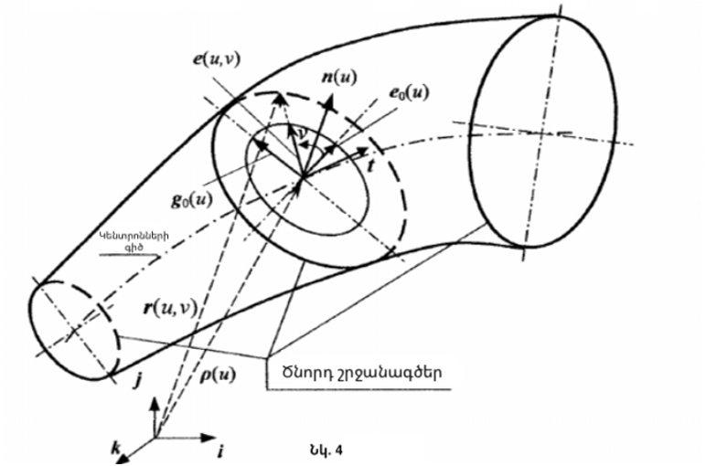
Նկ.4 Բազային ցիկլիկ մակերևույթ

$\vec r(u)$ — ցիկլիկ մակերևույթը կազմող շրջանագծերի կենտրոնների գծերի շառավիղ-վեկտորն է, իսկ  
$\vec e(u,v)=\vec e_0(u)\cos(v)+\vec g_0(u)\sin(v)$ մակերևույթը կազմող շրջանագծի հարթության մեջ
միավոր շառավղով շրջանագծի վեկտոր ֆունկցիան է։

Ծնորդ շրջանագծի հարթության դիրքը կենտրոնների գծի երկայնքով շարժվելիս որոշվում է
$\vec n(u)$ միավոր նորմալի վեկտորով։ $\vec e_0(u)$, $\vec g_0(u)$, $\vec n(u)$ վեկտորները կապված են կենտրոնների գծի Ֆրենեի եռանիստի հետ՝ $\tau,\ \nu,\ \beta$ հիմնական ցիկլիկ մակերևույթի ուղղորդող կորում [1]։

$$
\vec{OB}=\vec{\rho}(u,v)=\vec{OA}+\vec{AB}
=\vec r(u)+R_0(u)\big(\vec e_0(u)\cos v+\vec g_0(u)\sin v\big)
$$

$\vec e_0(u)$ և $\vec g_0(u)$-ն մակերևույթն առաջացնող շրջանագծի հարթության մեջ
միավոր օրթոգոնալ վեկտորներ են, իսկ $R_0(u)$-ն այդ շրջանագծերի շառավիղների
փոփոխման ֆունկցիան է։

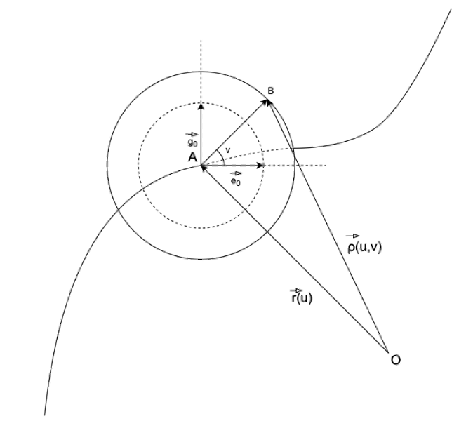

Նկ.5 Ցիկլիկ մակերևույթի երկրաչափական մեկնաբանություն

Տուփաձև մակերևույթի k-րդ նիստի բանաձևը ստանալու համար պետք է (1) բանաձևի աջ մասի երկրորդ գումարելին փոխարինել հավասարակողմ բազմանկյան k-րդ կողմի(լարի) հավասարումով։ k-րդ լարի նորմալ վեկտորը որոշվում է հետևյալ վեկտորով (նկ. 6. ա):

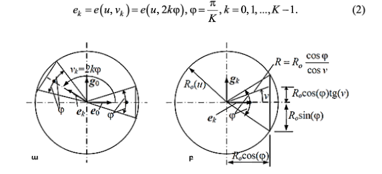
Նկ. 6 Տուփաձև մակերևույթի վեկտորական հավասարման ստացման երկրաչափական բացատրությունները

0-րդ համարի կողմի (լարի) հավասարումը կլինի

```math
\vec{r}_0(u,v)=R_0\cos\varphi\,\vec{e}_0+R_0(u)\cos\varphi\,\tan v\,\vec{g}_0,\qquad -\varphi\le v\le\varphi
```

Իսկ $k$-րդ համարի կողմի (լարի) հավասարման համար կստանանք

```math
\vec{r}_k(u,v)=R_0\cos\varphi\,\vec{e}_k+R_0(u)\cos\varphi\,\tan v\,\vec{g}_k,\qquad 0\le k\le K-1,\ \varphi=\frac{\pi}{K}\quad (3)
```

որտեղ $K$-ն կանոնավոր բազմանկյան կողմերի քանակն է $(K \ge 3)$։


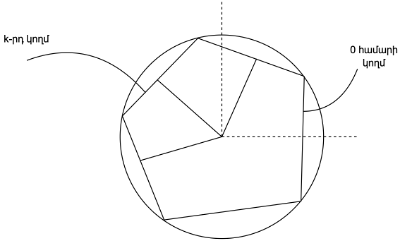

Նկ.7

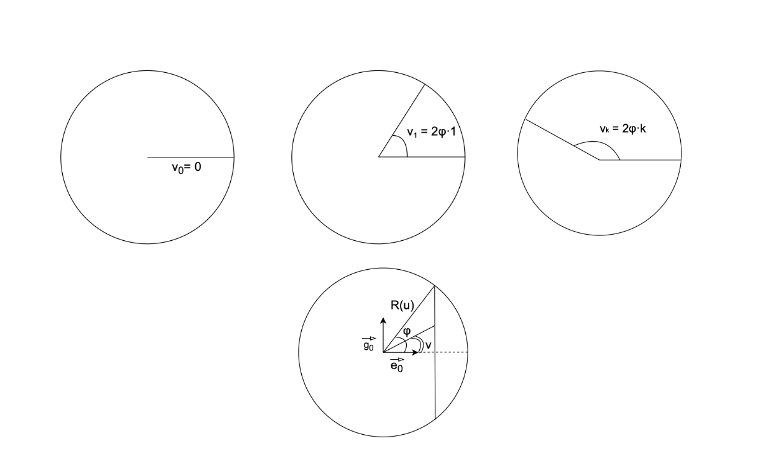
Նկ.8

```math
\{\vec{e}_0,\vec{g}_0\}\text{ բազիսից }\{\vec{e}_k,\vec{g}_k\}
\text{ բազիսը ստանալու համար առաջին բազիսը պետք է պտտենք }2\varphi k\text{ անկյունով։ Այդ դեպքում կստանանք`}
```

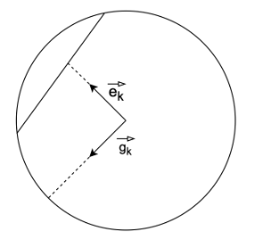

Նկ.9

$$
\vec e_k=\cos(2\varphi k)\\vec e_0+\sin(2\varphi k)\\vec g_0,
$$

$$
\vec g_k=-\sin(2\varphi k)\\vec e_0+\cos(2\varphi k)\\vec g_0:
$$


Տեղադրելով (3)-ի մեջ, կստանանք՝

```math
\begin{aligned}
\vec r_k(u,v)=
\frac{R_0(u)\cos\varphi}{\cos v}
\Big(
\vec e_0\cos v\cos(2\varphi k)
+\vec g_0\cos v\sin(2\varphi k) \\
-\vec e_0\sin v\sin(2\varphi k)
+\vec g_0\sin v\cos(2\varphi k)
\Big) \\
=
\frac{R_0(u)\cos\varphi}{\cos v}
\left(
\vec e_0\cos(v+2\varphi k)+\vec g_0\sin(v+2\varphi k)
\right) \\
=R(u,v)\,\vec e(u,v,k):
\end{aligned}
```

Այսպիսով,

$$
\vec r_k(u,v)=R(u,v)\\vec e(u,v,k) \quad (4)
$$

որտեղ

$$
R(u,v)=\frac{R_0(u)\cos\varphi}{\cos v},
$$

$$
\vec e(u,v,k)=
\cos(v+2\varphi k)\,\vec e_0(u)+
\sin(v+2\varphi k)\,\vec g_0(u):
$$

Այս դեպքում ստանում ենք տուփաձև մակերևույթի $k$-րդ նիստի վեկտորական հավասարումը՝

```math
\vec{\rho}_k(u,v)=\vec r(u)+\vec r_k(u,v)=\vec r(u)+R(u,v)\,\vec e(u,v,k) \qquad (5)
```

(5) հավասարումը հարթ կոորդինատային գծերի համակարգ ունեցող մակերևույթի հավասարում է, որտեղ $\vec r(u)$-ն ուղղորդ կորի վեկտորական հավասարումն է, իսկ $R(u,v)$-ը՝ հարթ կոորդինատային գծի հավասարումն է բևեռային կոորդինատական համակարգում՝ $\vec n(u)$ նորմալով հարթությունում։

Վերջնական տուփաձև մակերևույթի պարամետրական հավասարումը կլինի՝

```math
\vec{\rho}_k(u,v)=
\vec r(u)+
\frac{R_0(u)\cos\varphi}{\cos v}
\left(
\cos(v+2\varphi k)\,\vec e_0(u)+
\sin(v+2\varphi k)\,\vec g_0(u)
\right),
```
որտեղ $\vec e_0(u)$ և $\vec g_0(u)$ միավոր վեկտորները ընտրվում են հետևյալ բանաձևերով`

```math
\vec e_0(u)=
\frac{(\vec r'(u)\times\vec r''(u))\times\vec r'(u)}
{\left|\vec r'(u)\times\vec r''(u)\right|\cdot\left|\vec r'(u)\right|},
```

```math
\vec g_0(u)=
\frac{\vec r'(u)\times \vec r''(u)}
{\left|\vec r'(u)\times \vec r''(u)\right|}:
```

Նկ. 10-ում ներկայացված են կորագիծ տուփաձև բազմանիստ մակերևույթներ՝ տարբեր նիստերի թվով, հաստատուն և փոփոխական շառավղով ծնորդներով, ներառյալ ոլորված տուփաձև մակերևույթներ։ Այստեղ որպես ծնորդ շրջանագծերի կենտրոնների գիծը վերցվում է սինուսոիդը

$$
x=u,\qquad y=\alpha\sin(u),
$$

որտեղ

$$
\alpha = 0.75, \qquad u \in [0,2\pi].
$$

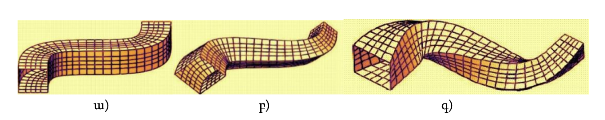

Նկ. 10. Հաստատուն լայնական հատույթով մակերևույթներ(ա), հիմքի ծնորդ շրջանագիծը կազմող շառավիղը փոխվում է գծային (բ), ներկայացված են ոլորված տուփաձև մակերևույթներ որոնց մակերևույթների պարամետրերը նման են բ-ին (գ)

# **§ 1.3 Բազմանիստ տուփաձև մակերևույթներ և դրանց կիրառումը ճարտարապետության մեջ**

Ժամանակակից ճարտարապետությունը բնութագրվում է ձևերի բազմազանությամբ։ Անալիտիկ երկրաչափությունը թույլ է տալիս ճարտարապետին ոգեշնչել երևակայությունը՝ օգտագործելով նոր ձևեր և մակերևույթներ։ Ավելին ճարտարապետությունում կիրառվող յուրաքանչյուր ձևի մաթեմատիկական հիմնավորումը թույլ է տալիս ոչ միայն նախագծել գեղեցիկ և ներդաշնակ(համաչափ) շենքեր, այլև ապահովել դրանց հուսալիությունը ճարտարագիտական տեսանկյունից։ Տուփաձև մակերևույթների՝ որպես ցիկլիկ մակերևույթների տարատեսակի հասկացությունը տրվել է Վ. Ն. Իվանովի կողմից \[4\]-ում։ Մասնավորապես, նա դիտարկել է տուփաձև մակերևույթներ, որոնք ձևավորվում են ցիկլիկ մակերևույթի շրջանագծում ներգծված կանոնավոր բազմանիստի շարժմումից։ Եթե ցիկլիկ մակերևույթն ձևավորվում է փոփոխական շառավիղ ունեցող շրջանագծի շարժման արդյունքում, ապա տուփաձև մակերևույթն ունի փոփոխական լայնական հատույթ: Եթե մակերևույթի ուղղորդողը կոր է, ապա ստացվում է կորագիծ տուփաձև մակերևույթ։  § 1.2-ում տրված դասակարգումը ցույց է տալիս, որ բազմանիստ տուփաձև մակերևույթները բազմազան են և ունեն հետաքրքիր ձևեր, որոնց հիման վրա կարելի է ստեղծել բազմաթիվ ինքնատիպ շենքեր։ Դիտարկենք շենքերի ճարտարապետության մեջ բազմանիստ տուփաձև կորագիծ մակերևույթների կիրառման օրինակներ ։

2005 թվականին Շվեդիայի Մալմյո քաղաքում կառուցված «Turning Torso» երկնաքերը (նկ. 11 ա, բ) անվանվել է «Եվրոպայի ամենաանսովոր երկնաքերը» ։ Ճարտարապետը՝ Սանտյագո Կալատրավան արժանացել է մրցանակի Կաննի միջազգային ցուցահանդեսում: Կենտրոնական կրող կառույցը պատրաստված է երկաթբետոնից, որը ներառում է հաղորդակցական համակարգերը, վերելակները և աստիճաններ։ 54-հարկանի շենքն ունի 190 մետր բարձրություն։ Լրացուցիչ կայունություն ապահովելու նպատակով շենքը երկնաքերի արտաքին հատվածում ունի կարկաս(հիմնակմախք)։ Վերին հնգանիստ պրիզմայի հարթությունը պտտված է ստորինի նկատմամբ 90°-ով։ Երկրաչափական տեսանկյունից շենքի ձևը կարելի է նկարագրել որպես հնգանիստ գլանաձև տուփաձև մակերևույթ։

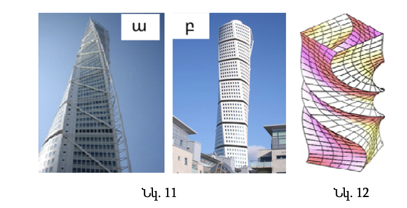


Նկ. 12-ում պատկերված է պարուրաձև քառանիստ գլանաձև տուփաձև մակերևույթ։ Նման ձև ունի «Helixxx Bridge»-ը (նկ. 13)՝ 82 մետր բացվածքով հետիոտնային կամուրջը, որը նախագծվել է ճարտարապետ Էուջենյո Ագլիետիի կողմից՝ Նիդեռլանդների Ամստերդամ քաղաքում գտնվող Էրմիտաժ թանգարանի առջևի մասում կառուցման համար: Կիսաթափանցիկ ապակյա թաղանթը հնարավորություն է տալիս հիանալ Ամստել գետի տեսարանով, իսկ ծակոտեն վահանակները ներսում ստեղծում են բարենպաստ միկրոկլիմա։

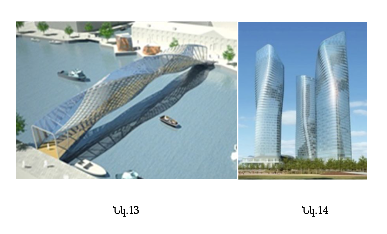

«Dancing Towers» բազմաֆունկցիոնալ համալիրը (նկ. 14), որի նախագիծը մշակվել է  ճարտարապետական ստուդիայի\` Studio Daniel Libeskind կողմից Սեուլի համար (Հարավային Կորեա), ունի ոլորված գլանաձև տուփաձև մակերևույթ, բայց արդեն քառանիստ ։ Երեք եզակի 41-հարկանի երկնաքերերն ունեն ձև, որը նման է բուդդայական վանականների տարազների երկար թևքերի շարժումներին ավանդական կորեական Seung Moo պարի ժամանակ։ 

Ճարտարապետական տեսանկյունից հետաքրքիր շենք է BBI աշտարակը (նկ. 15), որը նախագծվել է «Kusus + Kusus Architekten» ստուդիայի կողմից: Այս 31 մետր բարձրությամբ աշտարակը գտնվում է Բեռլինի օդանավակայանում և համարվում է դրա խորհրդանիշը։ Աշտարակի ուրվագիծը՝ հատակագծում եռանկյունաձև է ծավալային տեսանկյունից, որը կարծես պտտվել է քամու շարժումից։ Կառույցի արտաքին մասը պատված է պողպատե շրջանակի վրա ձգված սպիտակ վրանային թաղանթով որը ստեղծվում է թափանցիկության տպավորություն։ Գիշերը աշտարակի ներքին լուսավորության ստեղծվում է զարմանահրաշ էֆեկտ։ Շենքի ձևը ոլորված, կոնաձև, եռանիստ տուփաձև մակերևույթ է՝ հիմքում կոնաձև մակերևույթով (նկ. 16)։

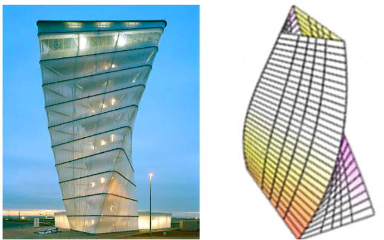


Նկ. 17-ում ներկայացված է Սանկտ Պետերբուրգում կառուցվող «Գազպրոմ»-ի նոր շենքի նախագիծը, որը մշակվել է «RMJM» ընկերության ճարտարապետների կողմից։ ։ 403 մետր բարձրությամբ ջահաձև երկնաքերը նախատեսվում է դառնալ Եվրոպայի ամենաբարձր և հիասքանչ շենքը։ Շենքի ձևին համապատասխանող անալիտիկ մակերևույթը կոնաձև ոլորված բազմանիստ տուփաձև մակերևույթ է (նկ. 18)։

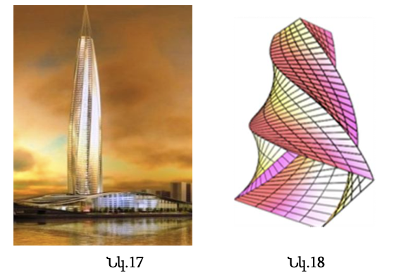

Դուբայում (ԱՄԷ) (նկ. 19) նախատեսվում է կառուցել ճարտարապետական նախագիծ, որը հավակնում է «նոր աշխարհի հրաշալիք» կոչմանը ։ Այն կլինի 4 աշտարակներից բաղկացած համալիր ՝ 54-ից մինչև 97 հարկ, որոնց ձևը հիշեցնում է վառվող մոմի բոց։ Նախագիծը մշակվել է Thompson, Ventulett, Stainback & Associates ճարտարապետական ընկերության կողմից ։ Բազմանիստ ոլորված տուփաձև մակերևույթը՝ որի հիմքի մակերևույթն ունի փոփոխական շառավղով ծնորդ շրջանագծեր, իսկ դրանց կենտրոնների գիծը սինուսոիդ է , որը հիանալի կերպով նկարագրում է համալիրը կազմող շենքերի ձևը (նկ. 20)։

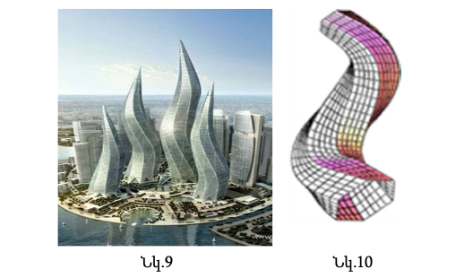


«Dynamic Tower» աշտարակի (նկ. 21) նախագիծը պատկանում է իտալացի ճարտարապետ Դևիդ Ֆիշերին։ Դինամիկ երկնաքերի գաղափարը առաջին անգամ իրականացվելու է Դուբայում։ Երկնաքերի կառուցվածքը բաղկացած է 59 մակարդակից, որոնք անկախ կերպով պտտվում են իրենց առանցքի շուրջ՝ բարձրության վրա գործող քամիների հոսքերի շնորհիվ՝ միաժամանակ արտադրելով էլեկտրաէներգիա։ Երկու միանման երկնաքերեր չկան դրանց ձևը անընդհատ փոխվում է։ Շենքի յուրահատկությունը կայանում է հետաքրքիր ճարտարապետական լուծման և այլընտրանքային էներգիայի աղբյուրների կիրառման համադրության մեջ։ Նկ. 22-ում ներկայացված է կոնաձև եռանկյունաձև ոլորված մակերևույթ:

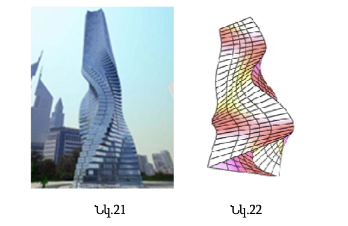


Նկ. 23-ում ներկայացված է Նովոսիբիրսկի Ակադեմիական քաղաքի Տեխնոպարկի Տեղեկատվական տեխնոլոգիաների կենտրոնի և համատեղ օգտագործման կենտրոնի նախագիծը: Շենքերի հարկերի քանակը և չափերը որոշվել են մաթեմատիկական հաշվարկներով ՝ հաշվի առնելով արևի հետագիծը և գերիշխող քամիների ուղղությունը,ինչը հնարավորություն է տվել օպտիմալացնել շենքերի լուսավորման, ջեռուցման և հովացման ծախսերը օրվա տարբեր ժամերին և տարվա տարբեր եղանակներին։ Շենքի ձևը համապատասխանում է ՝ հարթությունների փնջերում գտնվող հաստատուն լայնական հատույթով ոլորված քառանիստ տուփաձև մակերևույթի, որի կենտրոնների գիծը էլիպս է (նկ. 24)։

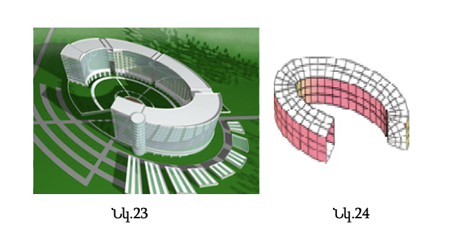


Իսպանական «Subarquitectura» ստուդիայի ճարտարապետները կարծում են, որ ճարտարապետությունը ցիկլիկ է։ Այդ սկզբունքը պատկերավոր ձևով ցույց տալու համար նրանք ստեղծել են «Casa 360°» համայնապատկերային տունը (նկ. 25, 26, 27)՝ պարույրի կամ գլուխը պոչի վրա հենած օձի տեսքով ։

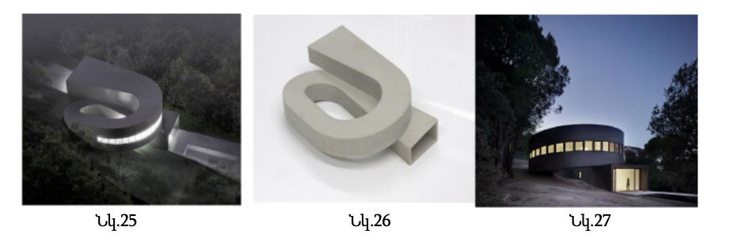


Երկրաչափական տեսանկյունից այս շենքը կարելի է նկարագրել որպես բազմանիստ կորագիծ տուփաձև մակերևույթ՝ հաստատուն լայնական հատույթով ՝«Արքիմեդյան պարույր» հիմնական ցիկլիկ մակերևույթով (նկ. 28)։

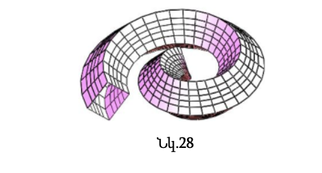


Ամստերդամի կենտրոնում գտնվող «Amstel Loop Iconic» կամրջի (նկ. 29) հեղինակներնեն  Evgeni Leonov Architects ճարտարապետական ստուդիայի մասնագետները։ Կամուրջը, որը նախատեսված չէ տրանսպորտային միջոցների (բացի հեծանիվներից) երթևեկության համար, միաժամանակ հանդիսանում է արվեստի առարկա։ Պողպատե տանիքով տեղամասերը, որոնք ոլորված են «օղակի » տեսքով, պաշտպանում են հետիոտներին և հեծանվորդներին քամուց, ձյունից և անձրևից։ Այս նախագծի հիմնական առավելությունն «օղակի» վերևում գտնվող դիտահարթակը, որը գեղատեսիլ տեսարան է բացում հանգստացողների համար։

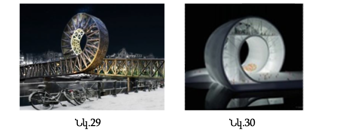


ԱՄՆ Ֆլորիդա նահանգի Սանկտ Պետերբուրգ քաղաքում նախատեսված ափամերձ գծի նախագիծը, որը ներկայացվել է դանիական «BIG architects» (Bjarke Ingels Group) ճարտարապետական և դիզայնի ստուդիայի կողմից, հաղթել է միջազգային դիզայնի մրցույթում։ Այս նախագիծը բաղկացած է երեք մասից․ The Wave\` քանդակազարդ օղակաձև շենք, , որտեղ տեղակայված են մանրածախ առևտրի կետեր, ռեստորաններ, բարեր և թատրոններ (նկ. 30),Tributary Park այգի կանոեների վարձույթի կետ, պիկնիկի գոտի և բուսաբանական այգի, իսկ Wave Walk-ը հանդիսանում է զբոսանավերի նավամատույց և լողավազան:

Դանիական «Bjarke Ingels Group» ճարտարապետական ընկերությունը ներկայացրել է իր «Walter» շենքի նախագիծը (նկ. 31), որը նախատեսվում է կառուցել Պրահայում։ Ընդհանուր՝ 32,000 քմ մակերեսով շենքը բաղկացած է չորս աշտարակներից, որոնք միավորված են մեկ ամբողջական կառույցի մեջ՝ W տառի ձևով։ Շենքում տեղակայվելու են ոչ միայն գրասենյակներ, այլև բնակարաններ, որոնցից բացվելու է տեսարան դեպի ամբողջ քաղաքը։ Յուրաքանչյուր աշտարակի ձևը համապատասխանում է հաստատուն լայնական հատույթով քառանիստ տուփաձև մակերևույթի, որի ծնորդ շրջանագծերի կենտրոնների գիծը սինուսոիդ է (նկ. 32)։

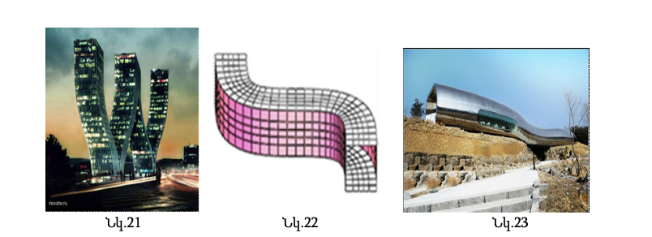


Նկ. 32-ում պատկերված մակերևույթով կարելի է նկարագրել նկ. 33-ում ներկայացված շենքի ձևը։ Դա Հարավային Կորեայում կառուցվող նախապատմական ժամանակների ուշագրավ թանգարանն է՝ «Jeongok Prehistory Museum», որը տեղակայվելու է Կյոնգիդո նահանգի հնագույն մարդկանց բնակավայրերից մեկի տարածքում։ Նախագիծը հեղինակել է ֆրանսիական «X-Tu architects» ճարտարապետական ստուդիան։ Թանգարանի շենքը ներկայացված է երկարավուն ծավալով, որը նման է հսկայական փայլուն խողովակի։ Այս ձևը ընտրվել է թանգարանի համար անհրաժեշտ օգտագործելի տարածք ապահովելու և միևնույն ժամանակ շրջակա միջավայրի հետ ներդաշնակորեն միաձուլվելու համար։

Հավիեր Սենոսիանն՝ աշխարհահռչակ «Nautilus» տան հեղինակն է, ստեղծել է ևս մեկ բացառիկ ճարտարապետական նախագիծ։ Այս անսովոր բնակելի համալիրը՝ «Quetzalcoatl's Nest » (նկ. 34 ա, 34 բ, 34 գ) ունի քառանիստ տուփաձև մակերևույթի ձև: Նախագիծը անվանակոչվել է ացտեկների փետրավոր օձի՝ գիտելիքի և ուսման աստծո պատվին։  Քանի որ «The Nest of Quetzalcoatl» գտնվում է կաղնիներով ծածկված անհարթ հողատարածքի վրա և պարունակում է բազմաթիվ քարանձավներ, դրա կառուցումը մեծ դժվարություններ էր ստեղծել,հատկապես հաշվի առնելով, որ ճարտարապետը իրավունք չուներ խաթարել գոյություն ունեցող բնական լանդշաֆտը կամ ոչնչացնել տարածքի 98 տոկոսը ծածկող բուսականությունը ։

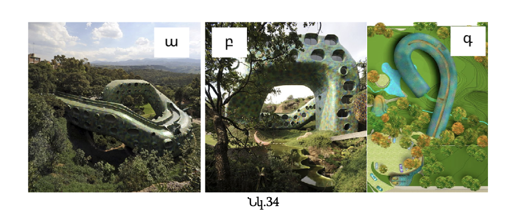


Միակ հասանելի հարթ տարածքը պետք էր օգտագործվեր որպես կայանատեղի։ Այս պայմաններում Սենոսիանն գտավ կիրճերն օգտագործելու հիանալի միջոց և ստեղծեց օձանման ձևով տուն ։ Չնայած « Quetzalcoatl's Nest » տեսքով էքսցենտրիկ (արտասովոր) ճարտարապետության օրինակ է, այն իրականում բնակելի տուն է։ Ոչ պակաս տպավորիչ ճարտարապետական նախագծեր, որոնք քննարկվում են ստորև նույնպես պատկանում են տարբեր տուփաձև մակերևույթների տարբերակներին: ԱՄԷ-ում՝ Marina լողափի մոտ, կառուցվում է  Oppenheim ճարտարապետական ընկերության գլուխգործոցը՝ երկու շենքերից բաղկացած բնակելի համալիր, որոնք գրեթե միանում են իրենց վերին հատվածներում՝թաքցնելով կանաչ այգի (նկ. 35)։

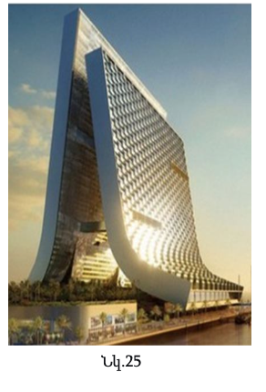


Այս բնակելի համալիրի արտաքին պատերը չեն լինի ամբողջական, այլ աստիճանաձև, և յուրաքանչյուր բնակարան ունենալու է սեփական կանաչ պատշգամբ։ Այս լուծումը թույլ կտա բնակարաններն ավելի լավ օդափոխել ծովային քամու միջոցով։ Դանիական BIG ընկերությունը Քվեբեկի Գեղարվեստի Ազգային թանգարանում ներկայացրել է ժամանակավոր ցուցահանդեսների տաղավարի նախագիծը (նկ. 36)։ Նախագիծը նախատեսում է մի շենքի կառուցում, որը արտաքինից հիշեցնում է երկու տուփ,որը կիսով չափ թաղված է գետնի մեջ՝

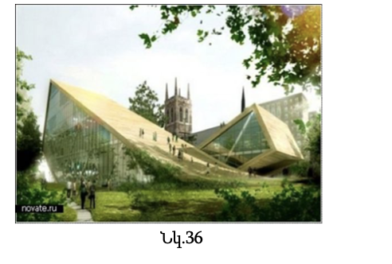


30–35° անկյան տակ։ Շենքերի ապակեպատ ուղղահայաց պատերը լավ լուսավորություն կապահովեն թանգարանային ցուցանմուշների համար :

Չինական հիերոգլիֆը «REN» նշանակում է «մարդկանց համար» և նման է «Լ» տառին։ Շանհայում կառուցվում է երկնաքեր, որի ձևը կրկնում է այդ հիերոգլիֆը (նկ. 37, 38)։ Կառույցը նախագծված է որպես երկու շենք, որոնք միաձուլվում են մեկի մեջ։ Առաջին շենքը կարծես «դուրս է գալիս» ջրից, իսկ երկրորդը «աճում է» գետնից։ Նախագծի հեղինակներն են Կոպենհագենում գործող Bjarke Ingels Group (BIG) ընկերության ճարտարապետները։ Նկ. 29-ում ներկայացված է Իտալիայի Մերանո–Ալտո Ադիջե շրջանում ավստրիացի ճարտարապետ Ստեֆան Ունգերի նախագծով կառուցված Villa San Valentino մասնավոր բնակելի տունը:

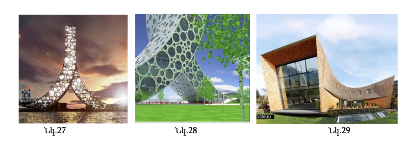


Ցյուրիխում շվեյցարական «Camenzind Evolution Architecture» ընկերությունը կառուցել է անսովոր պարուրաձև տուն(նկ. 40)։ Տան ներքին հարդարանքը ներկայացված է նկ. 41-ում։ Այս տունը տպավորիչ տեսք ունի ոչ միայն արտաքինից, այլև ներքինից։

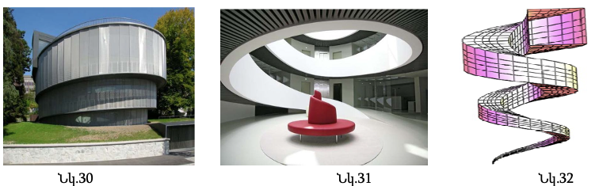


Շենքի երկրաչափական ձևը նման է պարուրաձև քառանիստ տուփաձև մակերևույթին, որը պատկերված է նկ. 42-ում։ Նմանատիպ մակերևույթով է նկարագրվում Դալասում (ԱՄՆ) գտնվող\` Շնորհակալության հրապարակում (Thanksgiving Square) տեղակայված մատուռի ձևը (նկ. 43 ա, 43 բ)։

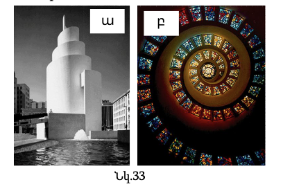


# **Գլուխ 2**

# **Տուփաձև մակերևույթների կիրառումը**

# **§ 2.1 Տուփաձև մակերևույթները ճանապարհների նախագման մեջ**

Վերևում դիտարկվել են բազմանիստ տուփաձև մակերևույթների որոշ տեսակներ, ինչպես նաև ցուցադրվել են ճարտարապետության մեջ տարբեր տուփաձև բազմանիստ մակերևույթների կիրառման հնարավորությունները։ Անշուշտ, տուփաձև մակերևույթների այլ տեսակներն էլ հետաքրքիր են ճարտարապետների համար։

Ներկանացված օրինակներով կարելի է ևս մեկ անգամ ճարտարապետների ուշադրությունը հրավիրել անալիտիկ երկրաչափության վրա ։ Անալիտիկ մակերևույթների կիրառումը ճարտարապետության մեջ կօգնի ճարտարապետներին իրենց աշխատանքներում հասնել ավելի մեծ ներդաշնակության :

Տուփաձև մակերևույթները լայն կիրառություն ունեն ճանապարհաշինության մեջ, քանի որ դրանք լավ են մոդելավորում ճանապարհի հարթ, բայց աստիճանաբար փոփոխվող հատվածները՝ ապահովելով հարթ անցումներ և կառուցվածքային կայունություն:Ահա հիմնական կիրառությունները.

1.  Ճանապարհի հատույթների ձևավորում: Ճանապարհը սովորաբար ունի լայնական թեքություն(ջրահեռացման համար) և երկայնական պրոֆիլ:Տուփաձև մակերևույթներով հնարավոր է մոդելավորել՝

- երթևեկելի մասի հարթությունը,
- կողային թեքությունները,
- անցումները ուղիղ հատվածից դեպի կոր մաս և շրջադարձ:

2.  Թեքությունների և անցումների հարթեցում: Ուղիղ հատվածից դեպի կոր հատված անցնելիս անհրաժեշտ է աստիճանական փոփոխություն:Տուփաձև մակերևույթները թույլ են տալիս ապահովել՝ 

- հարթ երկրաչափական անցում,
- առանց կտրուկ կոտրվածքների ձևափոխում,
- մեքենաների կայուն շարժում :

3.  Ջրահեռացման համակարգեր: Ճանապարհի մակերևույթը պետք է ունենա ճիշտ թեքություն, որպեսզի ջուրը չկուտակվի: Տուփաձև մակերևույթներով հնարավոր է ճշգրիտ հաշվարկել՝

- ջրի հոսանքի ուղղությունը,
- մակերևույթի թեքության աստիճանը,
- ջրահեռացման ակուսների ձևը:

4.  Հողի ծավալների հաշվարկ: Տուփաձև մակերևույթների միջոցով կարելի է հաշվել՝

- լցման և փորման ծավալները,
- ճանապարհի հիմքի ծավալը,
- բետոնապատման կամ ասֆալտապատման նյութի քանակը:

  
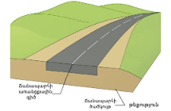

Ճանապարհների նախագծման մեջ տուփաձև մակերևույթը դա ճանապարհի եռաչափ անալիտիկ մոդելն է, որը ձևավորվում է ճանապարհի կենտրոնական գծի երկայնքով լայնական հատույթը. տեղաշարժելով :

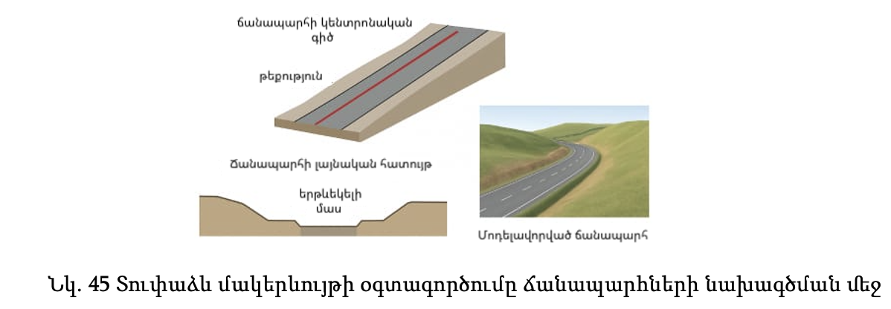

# **§ 2.2 Մի շարք կիրառական խնդիրների լուծում**


**Խնդիր 1**

Տարածության մեջ տրված է` 

$$
\vec r(u) = (u^2 + 1)\vec i + (u^3 + 2)\vec j + (2u - 3)\vec k
$$

ուղղորդ կորը որտեղ

$$
0 \le u \le 10, \qquad -\frac{\pi}{3} \le v \le \frac{\pi}{3}:
$$

Տուփաձև մակերևույթը բաղկացած է երեք նիստերից, այսինքն`

$$
K = 3
$$ 

(կանոնավոր եռանկյուն),

$$
k = 1,2,3
$$

իսկ անկյունային տեղաշարժը՝

$$
\varphi = \frac{\pi}{K}:
$$

$R_0(u)$-ն շրջանագծի շառավղի բանաձևն է, որը կարող է լինել հաստատուն և փոփոխական:

ա)

$$
R_0(u) = 5
$$

բ)

$$
R_0(u) = \frac{u^3 + 2}{u^2 + 1}
$$

Պահանջվում է կառուցել մակերևույթի

```math
\rho_k(u,v), \quad k=1,\dots,3
```

նիստերի պարամետրական հավասարումները`

```math
\vec{\rho}_k(u,v)=
\vec r(u)+
\frac{R_0(u)\cos\varphi}{\cos v}
\left(
\cos(v+2\varphi k)\,\vec e_0(u)+
\sin(v+2\varphi k)\,\vec g_0(u)
\right),
```
որտեղ $\vec e_0(u)$ և $\vec g_0(u)$ միավոր վեկտորները ընտրվում են հետևյալ բանաձևերով`

```math
\vec e_0(u)=
\frac{(\vec r'(u)\times\vec r''(u))\times\vec r'(u)}
{\left|\vec r'(u)\times\vec r''(u)\right|\cdot\left|\vec r'(u)\right|},
```

```math
\vec g_0(u)=
\frac{\vec r'(u)\times \vec r''(u)}
{\left|\vec r'(u)\times \vec r''(u)\right|}:
```

ինչպես նաև կառուցել տուփաձև մակերևույթը որպես այդ նիստերի միավորում՝

$$
S = \bigcup_{k=1}^{3} \rho_k(u,v),
$$

և իրականացնել դրանց գրաֆիկական պատկերումը:

ա)

$$
R_0(u) = 5
$$


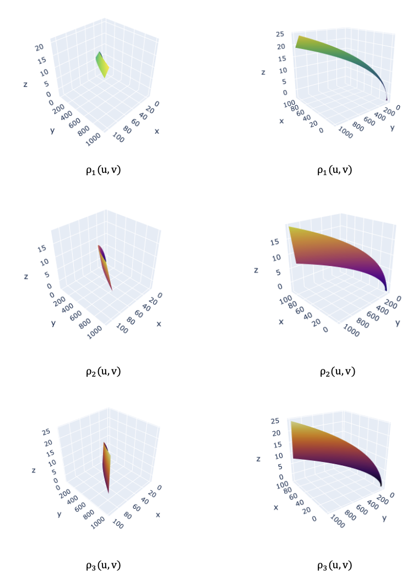

Խնդիր 1\-ի ա)տուփաձև մակերևույթը՝


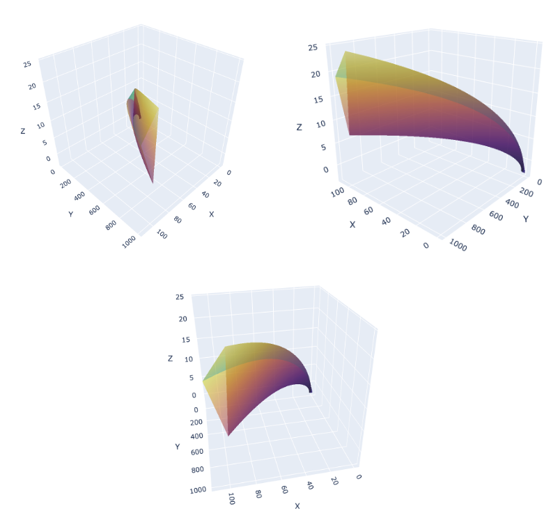


բ)

$$
R_0(u) = \frac{u^3 + 2}{u^2 + 1}
$$

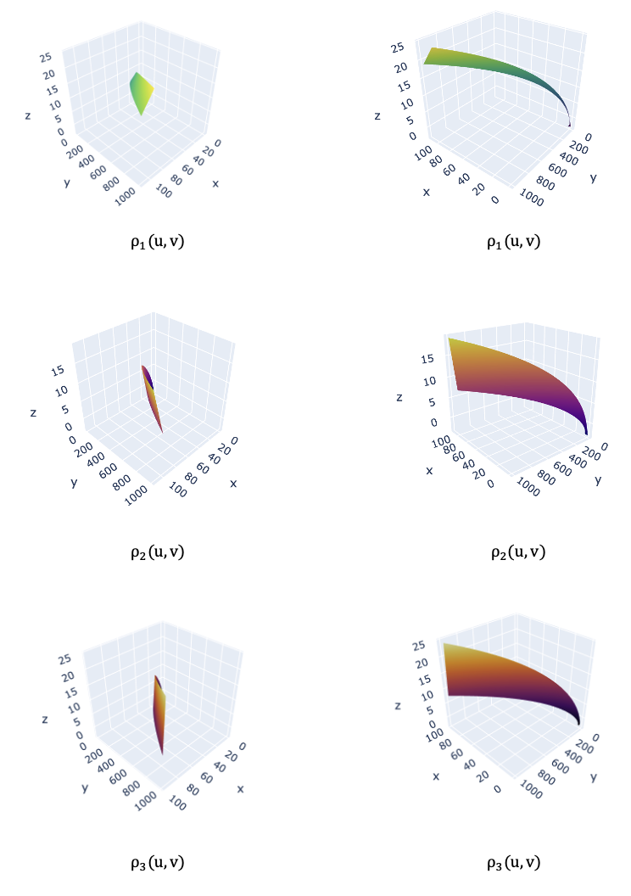

Խնդիր 1-ի բ) տուփաձև մակերևույթը՝

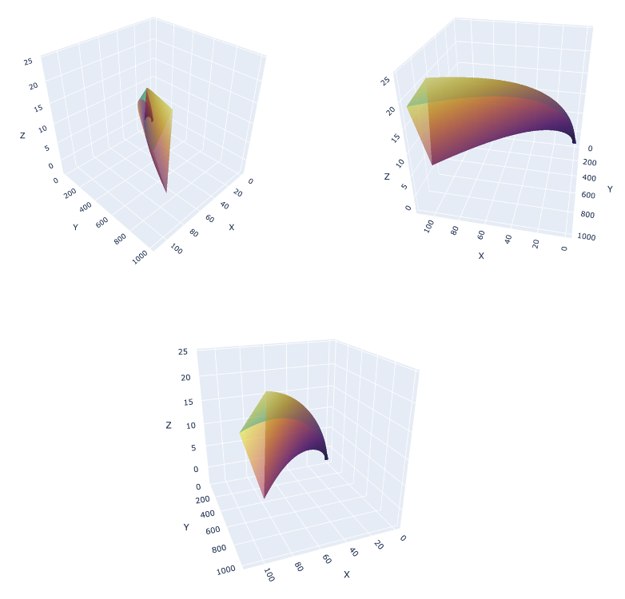

**Խնդիր 2**

Տարածության մեջ տրված է ուղղորդ կորը

$$
\vec r(u) = (u^2 + 1)\vec i + (u^3 + 2)\vec j + (2u - 3)\vec k
$$

որտեղ

$$
0.2 \le u \le 3:
$$

Դիտարկվում է տուփաձև մակերևույթ, որի լայնական հատույթը ուղղանկյուն է`  
$5 \times 2$ չափերով։

Ուղղանկյան կիսաչափերն են`

$$
a = \frac{5}{2} = 2.5, \qquad b = \frac{2}{2} = 1:
$$

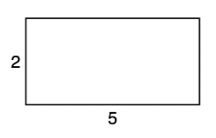

Տուփաձև մակերևույթը կառուցվում է չորս նիստերից՝ k = 1,2,3,4: Յուրաքանչյուր նիստի պարամետրական հավասարումը տրվում է հետևյալ կերպ`

$$
\vec{\rho}_k(u,v) =
\vec r(u) +
\frac{d_k}{\cos v}
\left(
\cos(v+\alpha_k)\vec e_0(u) +
\sin(v+\alpha_k)\vec g_0(u)
\right),
$$

որտեղ

$$
\alpha_k = \frac{(k-1)\pi}{2}, \qquad k=1,2,3,4
$$

իսկ $d_k$ արժեքները ընտրվում են հետևյալ կերպ`

$$
d_k =
\begin{cases}
a, & k=1,3, \\
b, & k=2,4.
\end{cases}
$$

Այստեղ $\vec e_0(u)$ և $\vec g_0(u)$ վեկտորները որոշվում են ուղղորդ կորի Ֆրենեի եռանիստի միջոցով և հաշվարկվում են հետևյալ բանաձևերով`

$$
\vec e_0(u) =
\frac{(\vec r''(u)\times \vec r'(u))\times \vec r'(u)}
{|\vec r'(u)\times \vec r''(u)|\,|\vec r'(u)|},
$$

$$
\vec g_0(u) =
\frac{\vec r'(u)\times \vec r''(u)}
{|\vec r'(u)\times \vec r''(u)|}:
$$

$v$-ի թույլատրելի միջակայքերը տարբեր են տարբեր նիստերի համար`

```math
v \in \left[-\arctan\!\left(\frac{b}{a}\right),
\arctan\!\left(\frac{b}{a}\right)\right], 
\qquad k=1,3
```


```math
v \in \left[-\arctan\!\left(\frac{a}{b}\right),
\arctan\!\left(\frac{a}{b}\right)\right], 
\qquad k=2,4
```

Պահանջվում է կառուցել տուփաձև մակերևույթի 

```math
\rho_k(u,v), \quad k=1,\dots,4
```

նիստերի պարամետրական հավասարումները, ինչպես նաև կառուցել տուփաձև մակերևույթը որպես այդ նիստերի միավորում՝


$$
S = \bigcup_{k=1}^{4} \rho_k(u,v),
$$

և իրականացնել դրանց գրաֆիկական պատկերումը: 

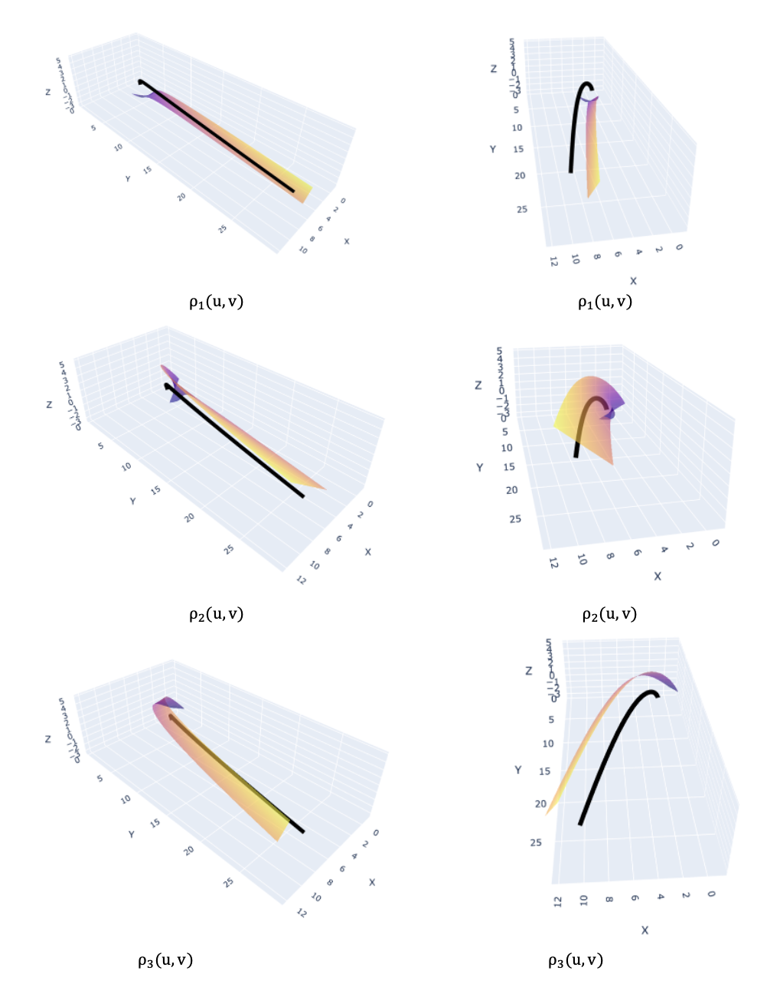

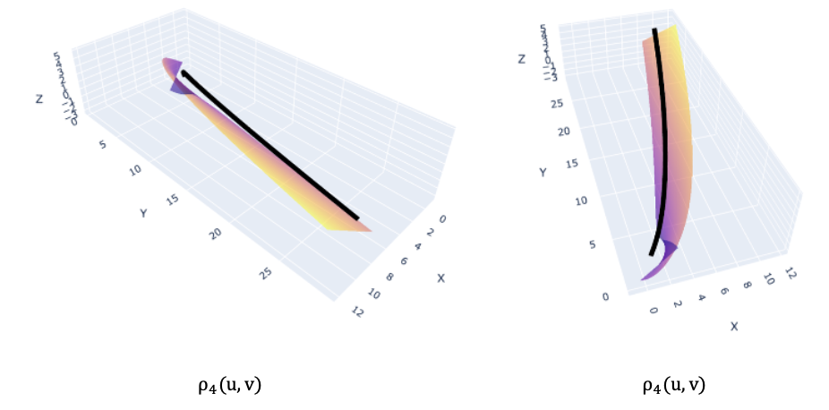

Խնդիր 2\-ի ա)տուփաձև մակերևույթը՝

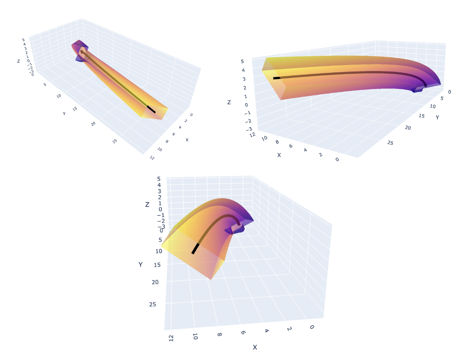

**Խնդիր 3**

Տարածության մեջ տրված է` 

$$
\vec r(u)=\left(u^2+1\right)\vec i+\left(u^3-u_0^3\right)\vec j+\left(2u+\left(5-2u_0\right)\right)\vec k,
\qquad 0.2\le u\le 3,
$$

ուղղորդ կորը որտեղ

$$
u_0=\sqrt{5.5},
$$

որը ընտրված է այնպես, որ

$$
\vec r(u_0)=(6.5,\,0,\,5):
$$

Լայնական հատույթը T-աձև պատկեր է, և (6.5,0,5)
կետը համապատասխանում է լայնական հատույթի ընտրված
կենտրոնին։

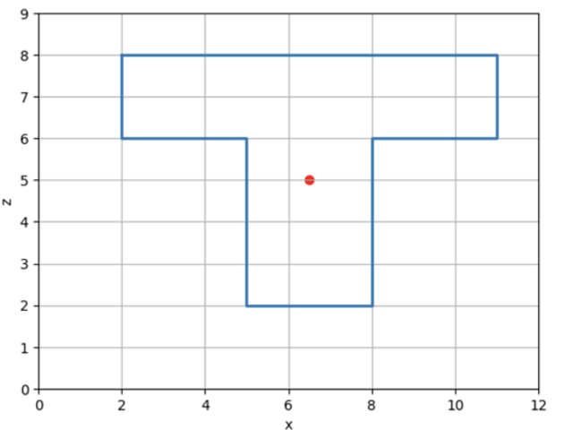

Տուփաձև մակերևույթը բաղկացած է ութ նիստերից, այսինքն k=1,2,3,4,5,6,7,8:

Յուրաքանչյուր նիստի պարամետրական հավասարումը տրվում է հետևյալ կերպ`

$$
\vec{\rho}_k(u,v)=
\vec r(u)+
\frac{d_k}{\cos v}
\left(
\cos(\beta_k+v)\,\vec e_0(u)+
\sin(\beta_k+v)\,\vec g_0(u)
\right),
$$

որտեղ $\beta_k$-ն սահմանում է k-րդ կողմի դիրքը հարթության մեջ հատույթի կենտրոնի նկատմամբ։

Մասնավորապես`

- եթե կողմը կենտրոնից վերև է, ապա
  ```math
  \beta_k=\frac{\pi}{2},
  ```
- եթե աջ է, ապա
 ```math
  \beta_k=0,
  ```
- եթե ներքև է, ապա
  ```math
  \beta_k=-\frac{\pi}{2},
  ```
- եթե ձախ է, ապա
  ```math
  \beta_k=\pi:
  ```

Ուստի տվյալ T-աձև  պատկերի համար ստացվում է`

$$
\beta_1=\frac{\pi}{2},\qquad
\beta_2=0,\qquad
\beta_3=\frac{\pi}{2},\qquad
\beta_4=0,
$$

$$
\beta_5=-\frac{\pi}{2},\qquad
\beta_6=\pi,\qquad
\beta_7=\frac{\pi}{2},\qquad
\beta_8=\pi:
$$


իսկ $d_k$-ն կենտրոնի և տվյալ կողմի կոորդինատի տարբերության բացարձակ արժեքն է՝

```math
d_k = |z_{\text{side}} - z_c|
\quad \text{կամ} \quad
d_k = |x_{\text{side}} - x_c|:
```


Քանի որ T-աձև  պատկերի գագաթներն են`

$$
(2,8),\ (11,8),\ (11,6),\ (8,6),\ (8,2),\ (5,2),\ (5,6),\ (2,6),
$$

իսկ կենտրոնը`

$$
(x_c,z_c)=(6.5,5),
$$

ստացվում են հետևյալ արժեքները`

$$
d_1=3,\qquad
d_2=4.5,\qquad
d_3=1,\qquad
d_4=1.5,
$$

$$
d_5=3,\qquad
d_6=1.5,\qquad
d_7=1,\qquad
d_8=4.5:
$$

Այստեղ $\vec e_0(u)$ և $\vec g_0(u)$ վեկտորները որոշվում են ուղղորդ կորի Ֆրենեի եռանիստի միջոցով և հաշվարկվում են հետևյալ բանաձևերով`

$$
\vec e_0(u) =
\frac{(\vec r''(u)\times \vec r'(u))\times \vec r'(u)}
{|\vec r'(u)\times \vec r''(u)|\,|\vec r'(u)|},
$$

$$
\vec g_0(u) =
\frac{\vec r'(u)\times \vec r''(u)}
{|\vec r'(u)\times \vec r''(u)|}:
$$


Տուփաձև մակերևույթի յուրաքանչյուր նիստի համար պարամետր $v$-ն սահմանափակվում է որոշակի միջակայքով՝

$$
v \in 
\left[
\arctan\left(\frac{z_1-z_c}{x_1-x_c}\right),
\arctan\left(\frac{z_2-z_c}{x_2-x_c}\right)
\right]:
$$

```math
\begin{aligned}
v &\in \left[-\arctan\frac{3}{2},\,\arctan\frac{3}{2}\right],\ k=1
\qquad
v \in \left[\arctan\frac{2}{9},\,\arctan\frac{2}{3}\right],\ k=2
\\[6pt]
v &\in \left[\arctan\frac{3}{2},\,\arctan\frac{9}{2}\right],\ k=3
\qquad
v \in \left[-\arctan 2,\,\arctan\frac{2}{3}\right],\ k=4
\\[6pt]
v &\in \left[-\arctan\frac{1}{2},\,\arctan\frac{1}{2}\right],\ k=5
\qquad
v \in \left[-\arctan\frac{2}{3},\,\arctan 2\right],\ k=6
\\[6pt]
v &\in \left[-\arctan\frac{9}{2},\,-\arctan\frac{3}{2}\right],\ k=7
\qquad
v \in \left[-\arctan\frac{2}{3},\,-\arctan\frac{2}{9}\right],\ k=8
\end{aligned}
```

Պահանջվում է կառուցել տուփաձև մակերևույթի 

```math
\rho_k(u,v), \quad k=1,\dots,8
```

նիստերի պարամետրական հավասարումները, ինչպես նաև կառուցել տուփաձև մակերևույթը որպես այդ նիստերի միավորում՝

$$
S = \bigcup_{k=1}^{8} \rho_k(u,v),
$$

և իրականացնել դրանց գրաֆիկական պատկերումը։

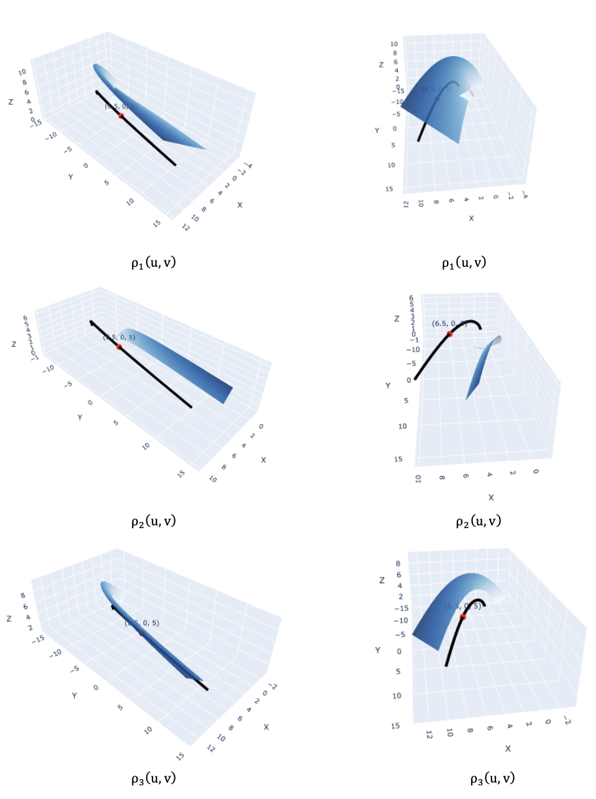

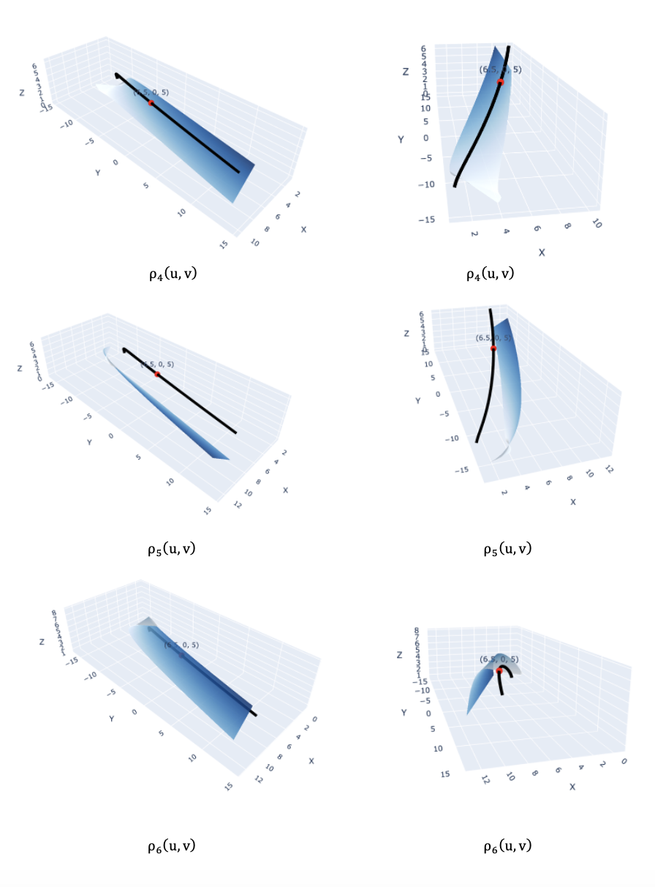

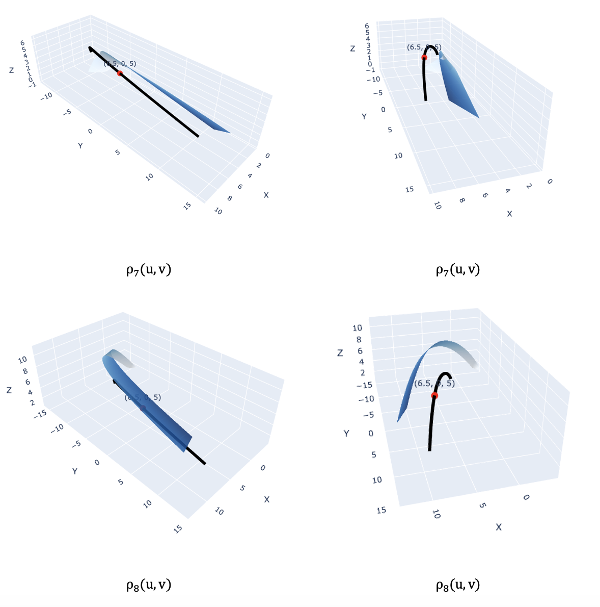

Խնդիր 3-ի տուփաձև մակերևույթը՝

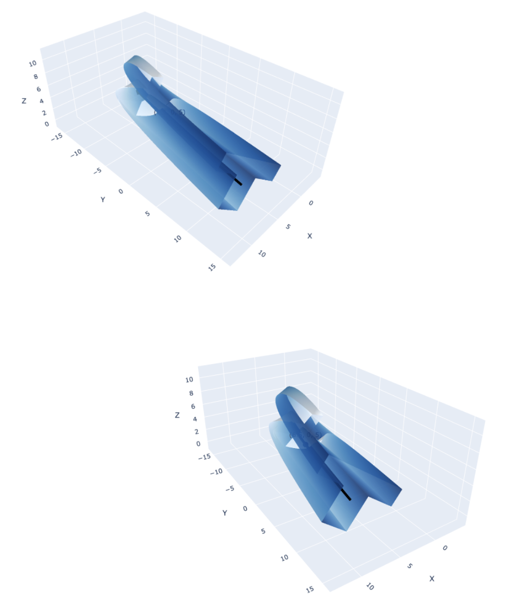

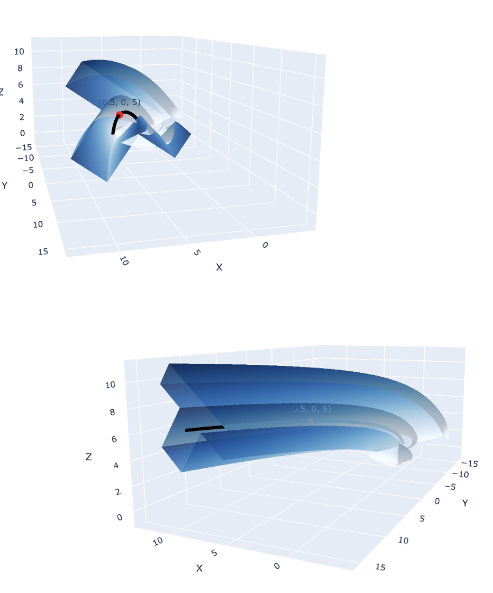

**Խնդիր 4**

Տարածության մեջ տրված է ուղղորդ կորը

$$
\vec{r}(u)=\left(u^2+1\right)\vec{i}+\left(u^3+2\right)\vec{j}+\left(2u-3\right)\vec{k},
\qquad 0.2\le u\le3 :
$$

Դիտարկվում է տուփաձև մակերևույթ, որի լայնական հատույթը հանդիսանում է քառանկյուն ABCD`

$$
A(-3.25,-1.25),\qquad
B(-2.25,1.75),\qquad
C(1.75,1.75),\qquad
D(3.75,-2.25):
$$

Տրված քառանկյան գագաթների միջոցով սահմանվում են համապատասխան տարածական կորերը`

$$
P_i(u)=\vec{r}(u)+x_i\,\vec{e}_0(u)+z_i\,\vec{g}_0(u),
\qquad i=1,2,3,4
$$

որտեղ $(x_i,z_i)$ քառանկյան համապատասխան գագաթների կոորդինատներն են, իսկ $\vec e_0(u)$ և $\vec g_0(u)$ վեկտորները որոշվում են ուղղորդ կորի Ֆրենեի եռանիստի միջոցով`

$$
\vec{e}_0(u)=
\frac{\left(\vec r'(u)\times \vec r''(u)\right)\times \vec r'(u)}
{\left|\vec r'(u)\times \vec r''(u)\right|\cdot\left|\vec r'(u)\right|},
$$

$$
\vec{g}_0(u)=
\frac{\vec r'(u)\times \vec r''(u)}
{\left|\vec r'(u)\times \vec r''(u)\right|}:
$$

Ստացված $P_1(u), P_2(u), P_3(u), P_4(u)$ կորերը հանդիսանում են մակերևույթի սահմանային կորեր։

Տուփաձև մակերևույթի նիստերը ստացվում են հարևան կորերի միջև գծային ինտերպոլացիայով`

$$
\vec{\rho}_k(u,v)=(1-v)P_k(u)+vP_{k+1}(u),
\qquad k=1,2,3,4:
$$

Պահանջվում է կառուցել տուփաձև մակերևույթի

$$
\rho_k(u,v), \qquad k=1,\ldots,4
$$

նիստերի պարամետրական հավասարումները, ինչպես նաև կառուցել տուփաձև մակերևույթը որպես այդ նիստերի միավորում`

$$
S=\bigcup_{k=1}^{4}\rho_k(u,v)
$$

և իրականացնել դրանց գրաֆիկական պատկերումը։


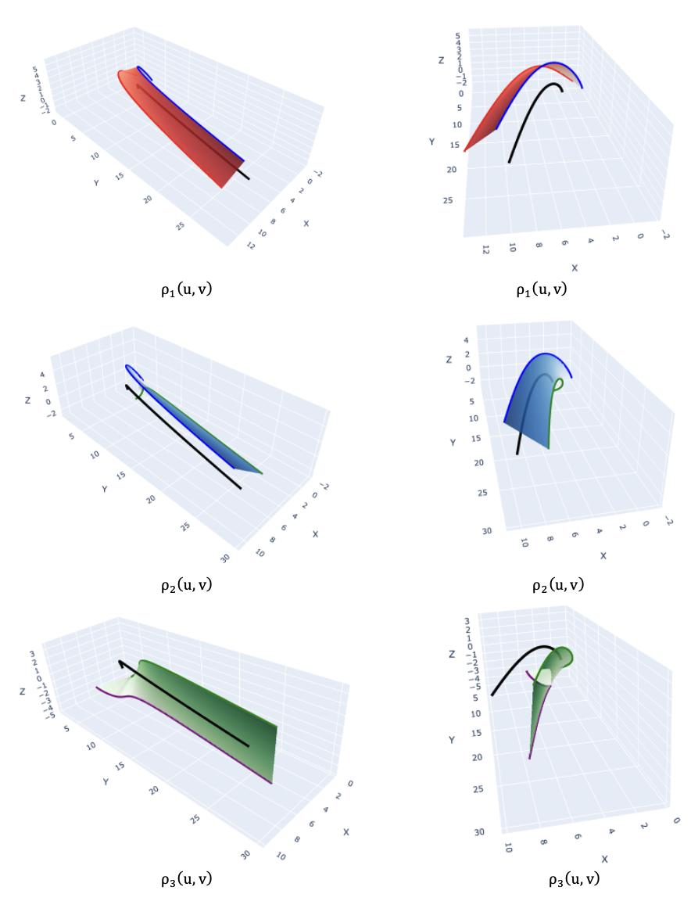


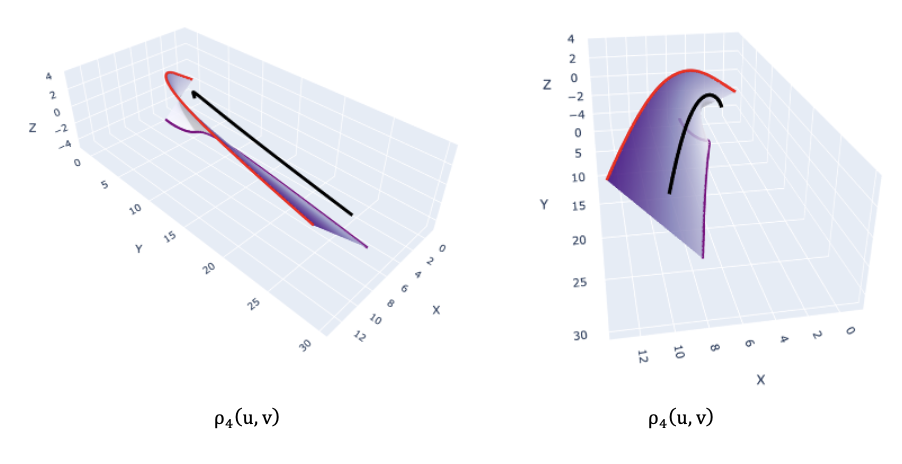

Խնդիր 4-ի տուփաձև մակերևույթը՝


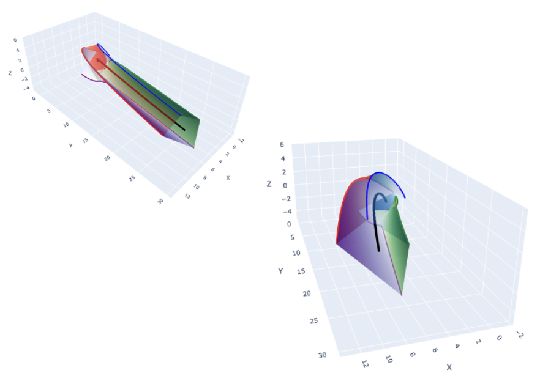


**Խնդիր 5**

Դիցուք տարածության մեջ տրված է բնական հավասարումով տրված

```math
\vec{r}(s)=\{s;\;0;\;0,01s^2\}
```

կորը, որտեղ $s \in [0;100]$ մետր։

Ճանապարհի կես լայնությունը՝ $a = 5\\text{մ}$, իսկ լայնական թեքությունը՝ $0.02$ (այսինքն $2\%$)։
Այդ դեպքում մակերևույթի պարամետրական հավասարումը կլինի՝

```math
R(s,t)=\{s;\;t;\;0,01s^2+0,02t\},
\qquad s\in[0;100], \quad t\in[-5;5]:
```

Տուփաձևությունը արտահայտվում է

$$
D=[0;100]\times[-5;5]
$$

պարամետրերի ուղղանկյուն տիրույթով։


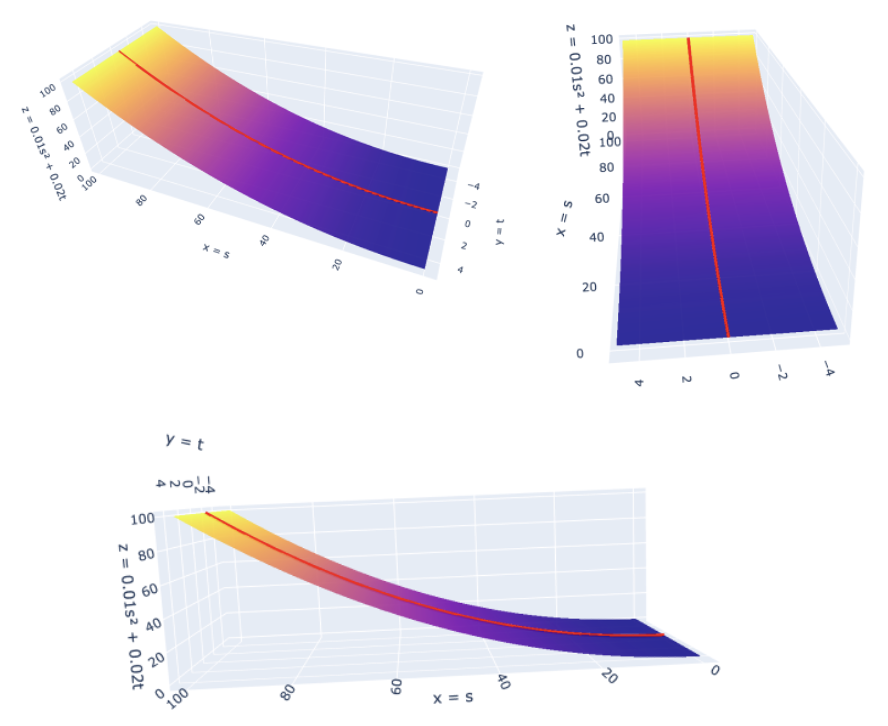

**Գրականություն**

1.  Скворцов А.В. Триангуляция Делоне и её применение. Томск: Изд-во Том. ун-та, 2002. 128с.
2.  Бойков В.Н., Шумилов Б.М. Сплайны в трассировании автомобильных дорог. Томск: Изд-во ГУ Том. ЦНТИ, 2001, 164с.
3.  Иванов В.Н. Геометрия циклических поверхностей // Сборник научных трудов аспирантов инженерного факультета. Вып. VIII, Москва: РУДН, 1971. С.137–142.
4.  Ivanov V.N. (2012) Geometry and forming of polygonal box curvilinear surfaces on a basic cyclic surface, Structural Mechanics of Engineering Constructions and Buildings, No.2, pp. 3–11.

**Եզրակացություն**

Ավարտական աշխատանքում ուսումնասիրվել են ավտոմոբիլային ճանապարհների երթուղիների տարածական մոդելավորման մաթեմատիկական մեթոդը, կապ է հաստատվել ավտոմոբիլային ճանապարհների նախագծման ընթացքում հատակագծի և պրոֆիլի կորերի տարածական զուգորդման բազմամյա դիտարկումների արդյունքում ստացված էմպիրիկ տվյալների և գլխավոր գծերի տեսողական պարզության ու հարթության հասկացության միջև, դրանց ազդեցությունը վարորդների հոգեէմոցիոնալ վիճակի, տեսանելիության, երթևեկության(շարժման) ուղղության ճիշտ ճանաչման (հատկապես մեծ արագությունների դեպքում) և, ի վերջո, անվտանգության վրա:

Ներկայացված ավարտական աշխատանքի հետազոտության արդյունքում առաջարկվում է ավտոմոբիլային ճանապարհների երթուղիների տարածական մոդելավորման վերանորոգման և կապիտալ վերանորոգուման նոր մաթեմատիկական մեթոդ՝ հիմնվելով բաց բազմանիստերի շարժմամբ ձևավորված տուփաձև մակերևույթների վրա: Այս մաթեմատիկական մոդելը կարող է օգտագործվել ավտոմոբիլային ճանապարհների տեղեկատվական մոդելավորման (BIM մոդելավորման) տեխնոլոգիայում:
